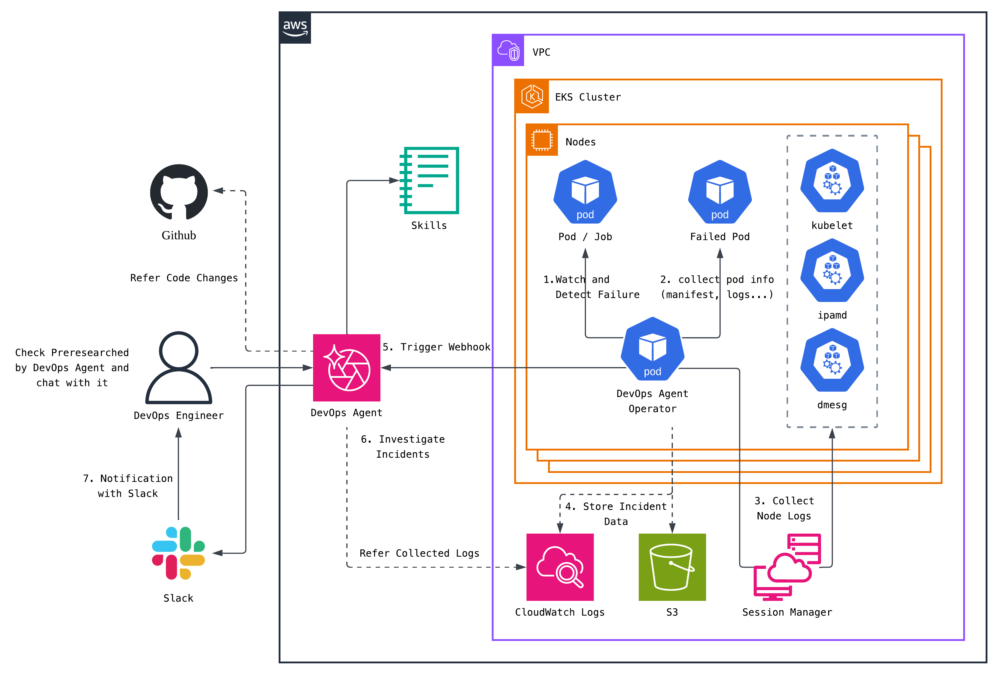

> **English** | [한국어](README.ko.md)

# DevOps Agent Operator

DevOps Agent Operator is a Kubernetes Operator that detects Pod workload failures in real time on Amazon EKS, automatically gathers the information needed for troubleshooting, and triggers an investigation by [AWS DevOps Agent](https://aws.amazon.com/devops-agent/).



## How It Works

DevOps Agent Operator subscribes to Pod state changes via the Kubernetes Watch API in real time. As soon as a failure is detected, it collects data and forwards it to external systems.

```
Pod state change → EventFilter (only failure-state changes pass)
    → detectPodFailure (5-layer detection)
    → Data collection (manifest, describe, logs, events, node logs)
    → Output (CloudWatch Logs / S3 / Webhook)
    → Mark as processed (annotation-based dedup)
```

### Failure Detection

The operator follows a whitelist-based principle: "if it isn't normal, it's abnormal." It inspects five layers in priority order:

| Layer | Detected Conditions | Examples |
|-------|---------------------|----------|
| 1. Pod Status Reason | Root-cause signals | Evicted, DeadlineExceeded |
| 2. Container Waiting | Abnormal waiting states | CrashLoopBackOff, ImagePullBackOff, ErrImagePull |
| 3. Container Terminated | Abnormal termination | OOMKilled, Error, NonZeroExit |
| 4. Pod Phase | Pod-level state | PodFailed, PodUnknown |
| 5. Pod Conditions | Scheduling conditions | Unschedulable |

Transient states such as ContainerCreating and Unschedulable are promoted to a failure only when they remain unresolved past the configured grace period (default: 3 minutes).

### Data Collection

When a failure is detected, the following information is collected immediately:

- Pod manifest (full YAML)
- Pod describe (detailed status)
- Container logs (current + previous)
- Kubernetes Events (timeline of Pod-related events)
- Node logs via AWS SSM (kubelet/containerd/dmesg/ipamd/ipamd-introspection/networking/disk/inode/memory)

### Output

Three outputs can be enabled independently based on configuration:

- CloudWatch Logs: incident events as structured JSON
- S3: hierarchical file storage (manifest, logs, node-logs, etc.)
- Webhook: incident payload signed with HMAC-SHA256, sent to the DevOps Agent


## Project Layout

```
├── cmd/main.go                     # Entry point
├── internal/
│   ├── controller/
│   │   ├── pod_controller.go       # Pod Watch, failure detection, data-collection orchestration
│   │   └── detector.go             # 5-layer failure detection logic
│   ├── collector/
│   │   ├── types.go                # Data structure definitions
│   │   ├── logs.go                 # Container log collection
│   │   ├── ssm.go                  # AWS SSM node-log collection (parallel execution)
│   │   └── severity.go             # Severity mapping by failure type
│   ├── output/
│   │   ├── webhook.go              # DevOps Agent webhook (HMAC signing, priority mapping)
│   │   ├── s3.go                   # S3 upload
│   │   └── cloudwatch.go           # CloudWatch Logs output
│   └── config/
│       └── config.go               # Environment-variable-based config management
├── config/                         # Kubernetes manifests (Kustomize)
├── test/                           # E2E tests
├── examples/                       # Deployment examples (YAML, Terraform)
├── runbooks/                       # Operational runbooks
├── Dockerfile
└── Makefile
```

## Environment Variables

### Cluster Metadata

| Name | Description | Default |
|------|-------------|---------|
| `EKS_CLUSTER_NAME` | EKS cluster name | - |
| `AWS_REGION` | AWS region. Used as the target region for AWS SDK clients (SSM, S3, CloudWatch Logs, etc.). To use S3 buckets or CloudWatch Logs groups in a different region than the cluster, set this accordingly. For webhook triggers, this value is included only as informational metadata in the payload. | `us-east-1` |
| `AWS_ACCOUNT_ID` | AWS account ID | - |

### Output Settings

| Name | Description | Default |
|------|-------------|---------|
| `DEVOPS_AGENT_WEBHOOK_URL` | DevOps Agent webhook URL | - |
| `DEVOPS_AGENT_WEBHOOK_SECRET` | HMAC signing secret | - |
| `WEBHOOK_TIMEOUT` | Webhook timeout | `30s` |
| `CLOUDWATCH_LOG_GROUP` | CloudWatch Logs group | - |
| `S3_BUCKET` | S3 bucket name | - |
| `S3_PREFIX` | S3 key prefix | - |

### Feature Settings

| Name | Description | Default |
|------|-------------|---------|
| `ENABLE_SSM_COLLECTION` | Enable SSM node-log collection | `false` |
| `WATCH_NAMESPACES` | Watched namespaces (comma-separated) | all |
| `EXCLUDE_NAMESPACES` | Excluded namespaces | `kube-system,kube-public,kube-node-lease` |
| `LOG_SINCE_MINUTES` | Time window (in minutes) for log collection | `15` |
| `PROCESSED_TTL` | Duration to suppress duplicate processing | `1h` |
| `FAILURE_GRACE_PERIOD` | Timeout grace period | `3m` |
| `FAILURE_RECHECK_INTERVAL` | Recheck interval for timeouts | `1m` |
| `WEBHOOK_SKIP_CATEGORIES` | Detection layers to skip for webhook/S3/CloudWatch output (comma-separated) | - |
| `WEBHOOK_MIN_SEVERITY` | Minimum severity that triggers output | - |

#### Output Filtering

`WEBHOOK_SKIP_CATEGORIES` and `WEBHOOK_MIN_SEVERITY` are combined with AND logic. Output to CloudWatch Logs, S3, and Webhook runs only when both conditions pass. If neither is set, output runs for every failure.

**WEBHOOK_SKIP_CATEGORIES** — excludes failures from specific detection layers from the output.

Valid values: `ContainerWaiting`, `ContainerTerminated`, `PodPhase`, `PodStatus`, `PodCondition` ([detection layer details](docs/en/ARCHITECTURE.md#five-detection-layers))

```
# Do not output Layer 4 and Layer 5 failures
WEBHOOK_SKIP_CATEGORIES=PodPhase,PodCondition
```

**WEBHOOK_MIN_SEVERITY** — outputs only failures at or above the configured severity.

Valid values (lower index = more severe): `CRITICAL`, `HIGH`, `MEDIUM`, `LOW` ([failure types by severity](docs/en/ARCHITECTURE.md#step-6-severity-determination--determineseverity))

```
# Output only HIGH and above (CRITICAL, HIGH)
WEBHOOK_MIN_SEVERITY=HIGH
```

You can combine the two options for finer control.

```
# Always exclude PodPhase + output the rest only when HIGH or above
WEBHOOK_SKIP_CATEGORIES=PodPhase,PodCondition
WEBHOOK_MIN_SEVERITY=HIGH
```

## IAM Permissions

The Operator Pod needs the following IAM permissions. Adjust the resource ARNs to match your environment.

```json
{
  "Version": "2012-10-17",
  "Statement": [
    {
      "Sid": "SSMCommandExecution",
      "Effect": "Allow",
      "Action": [
        "ssm:SendCommand",
        "ssm:GetCommandInvocation"
      ],
      "Resource": [
        "arn:aws:ec2:<REGION>:<ACCOUNT_ID>:instance/*",
        "arn:aws:ssm:<REGION>:<ACCOUNT_ID>:*"
      ]
    },
    {
      "Sid": "S3LogStorage",
      "Effect": "Allow",
      "Action": [
        "s3:PutObject",
        "s3:PutObjectAcl"
      ],
      "Resource": "arn:aws:s3:::<S3_BUCKET>/*"
    },
    {
      "Sid": "S3BucketAccess",
      "Effect": "Allow",
      "Action": [
        "s3:ListBucket"
      ],
      "Resource": "arn:aws:s3:::<S3_BUCKET>"
    },
    {
      "Sid": "CloudWatchLogsIncidentStorage",
      "Effect": "Allow",
      "Action": [
        "logs:CreateLogStream",
        "logs:PutLogEvents"
      ],
      "Resource": "arn:aws:logs:<REGION>:<ACCOUNT_ID>:log-group:<LOG_GROUP>:*"
    }
  ]
}
```
